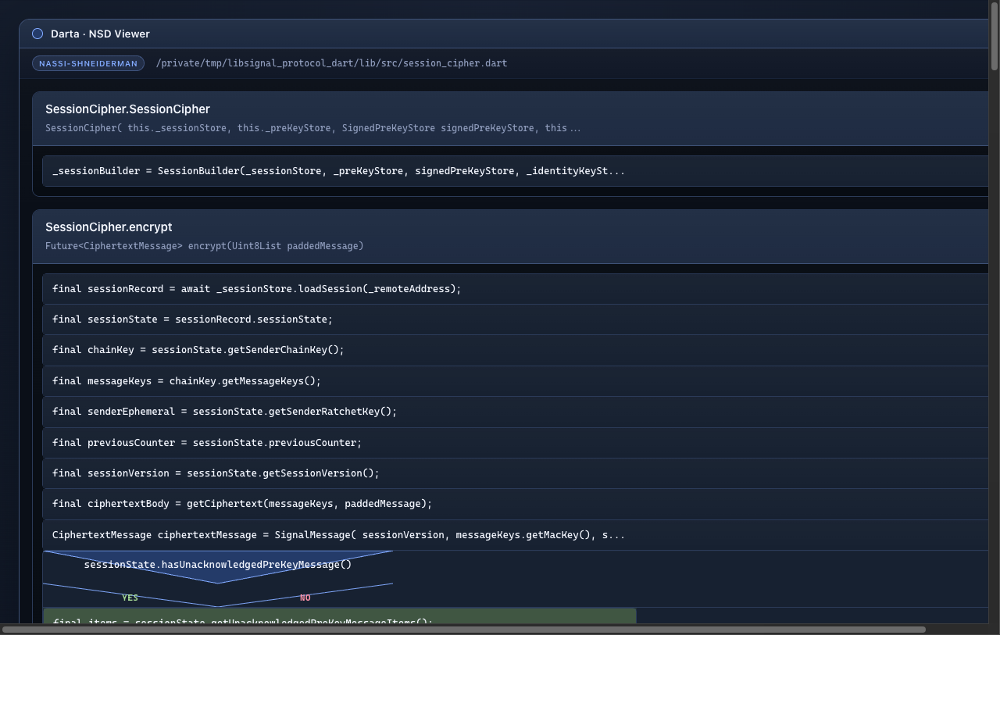
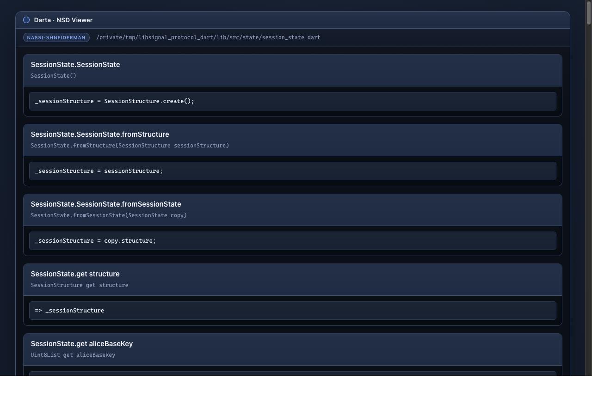

# Darta

Darta parses Dart source code through ANTLR and renders Nassi-Shneiderman diagrams as self-contained HTML pages. The architecture is DDD-inspired with hexagonal boundaries so the ANTLR infrastructure stays behind ports and the domain layer stays independent.

## What it does

**Parsing**

* parse a single `.dart` file or an entire directory tree
* extract a structural model: imports, classes, mixins, extensions, enums, functions
* report syntax diagnostics as part of the output contract

**Control flow extraction**

* if / else-if / else chains (including Dart 3 pattern guards)
* while and do-while loops
* for and for-in loops
* switch / case / default (classic and Dart 3 pattern-matching)
* try / on / catch / finally blocks
* `await` expressions — visually distinguished from synchronous actions

**Function discovery**

* top-level functions, getters, setters
* class / mixin / extension / extension-type methods, getters, setters
* constructors (default, named, factory)
* operator overloads

**Nassi-Shneiderman diagrams**

* build an NSD HTML page for one Dart file
* build an NSD bundle with an index page for an entire directory
* classic NS triangles for if-blocks with Yes / No labels
* depth-coded nested ifs — up to 50 levels with color cycling and Unicode badges ①–㊿
* side-by-side columns for switch/case blocks
* `await` steps rendered with a purple accent to mark async boundaries
* dark Tokyo Night-inspired theme with JetBrains Mono font

### Screenshots

**`session_cipher.dart`** — constructor entry, sequential actions, and an if-block with Yes/No branches:



**`session_state.dart`** — named constructors and getters extracted as first-class diagram entries:



## Architecture

Four explicit layers:

| Layer | Responsibility |
|---|---|
| `domain` | model, invariants, ports, domain events |
| `application` | use cases, DTOs |
| `infrastructure` | ANTLR adapter, filesystem, event publishing |
| `presentation` | CLI |

## Quick Start

1. Install dependencies:

```bash
uv sync --extra dev
```

2. Generate the Dart parser from the vendored grammar:

```bash
uv run python scripts/generate_dart_parser.py
```

3. Parse a single file:

```bash
uv run darta parse-file path/to/file.dart
```

4. Parse a directory:

```bash
uv run darta parse-dir path/to/project
```

5. Build a Nassi-Shneiderman diagram for one Dart file:

```bash
uv run darta nassi-file path/to/algorithms.dart --out output/algorithms.nassi.html
```

6. Build diagrams for an entire directory:

```bash
uv run darta nassi-dir path/to/project --out output/nassi-bundle
```

## Constraints

The Dart2 grammar is sourced from `antlr/grammars-v4/dart2`. It targets Dart 2.15 syntax and requires a `Dart2LexerBase` support class for string-interpolation predicates. Grammar limitations and version metadata are surfaced at runtime so downstream consumers know the contract they are integrating with.

## Next Steps

* richer control flow: async/await, yield, cascade operators
* symbol graph export
* semantic passes on top of the structural model
* incremental parsing and caching
* collapsible nodes in the HTML diagrams
* export to SVG / PNG / Mermaid
